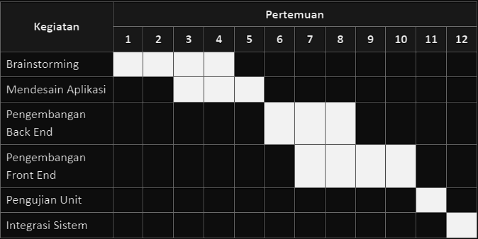

## ManageIT Team
1. Angelica Callysta Viera - 21/474719/TK/52377
2. Rico Frijaya
3. Partahi Bonaruli Sitorus - 21/482615/TK/53324
# "Project Senior Project TI"
Departemen Teknik Elektro dan Teknologi Informasi, Fakultas Teknik, Universitas Gadjah Mada

## Nama Produk : ProScheduler
## Jenis Produk : Web App Produktivitas
## Latar Belakang : 
Tahap perancangan suatu proyek menjadi awal penentu apakah proyek dapat berjalan lancar atau tidak. Untuk dapat merancang proyek dengan efisien dibutuhkan referensi dan pengalaman yang cukup tentang proyek yang terkait. Bagi seorang pemula, pengalaman dan referensi ini bisa menjadi hambatan dalam melakukan perancangan. Dari latar belakang masalah ini lah produk kami dapat membantu proses perancangan proyek. Produk kami bertujuan untuk membantu perancangan proyek dalam menyusun target-target proyek, memberikan masukan dalam perancangan lini masa pengerjaan proyek, dan mengukur serta membantu meningkatkan efisiensi proyek. Target, lini masa, dan nilai efisiensi yang dihasilkan dari produk kami didasar dari beberapa proyek-proyek terdahulu yang memiliki kesamaan dengan proyek yang diajukan pengguna.
## Rumusan masalah :
1. Bagaimana teknologi dapat membantu penjadwalan pengerjaan suatu project secara otomatis?
2. Bagaimana menentukan tingkat efisiensi suatu project berdasarkan target capaian dan sumber daya yang dimiliki?

## Metodologi SDLC
Metodologi yang digunakan: 
 **Kanban**

Alasan Pemilihan Metodologi:  
Metode kanban memberikan kemudahan dalam melakukan perencanaan kerja dan pengelolaan kerja dengan memberikan batasan waktu pengerjaan untuk tiap target dan memberikan level prioritas pada tiap targetnya. Kanban juga memberikan kemudahan untuk menambahkan pekerjaan baru ditengah - tengah pengerjaan produk. Misalnya ketika kita ingin menambahkan fitur baru secara mendadak, kita dapat menambahkan target baru untuk membuat fitur ini dan pengerjaannya dapat disesuaikan dengan prioritasnya diantara target - target lainnya

## Tujuan Produk

Produk ini bertujuan untuk menjadi alat bantu dalam merencanakan suatu proyek. Produk ini berfokus untuk bisa memberikan kemudahan mengakses informasi tentang kemajuan proyek pada tiap anggota team. Produk ini juga dapat memberikan referensi linimasa dalam perancangan dan pengerjaan proyek.

## Pengguna Potensial dari Produk
Pengguna potensial dari produk ini adalah mahasiswa dan team - team start up kecil. Hal ini didasari pada asumsi bahwa kedua target pengguna ini kerap dihadapkan dalam tantangan menjalankan suatu proyek berukuran kecil hingga menengah namun mereka juga masih awam dalam pengelolaan alur kerja dari pengerjaan proyek sehingga perlu alat bantuan yang dapat membantu memberikan referensi pengerjaan dan mengatur alur pengerjaan proyek.

## Usecase Diagram

## Functional Requirement

| **FR** | **Deskripsi**                                                |
| ------ | ------------------------------------------------------------ |
| FR-1   | User dapat membuat Schedule baru dan atau meng-edit schedule yang dihasilkan oleh AI |
| FR-2   | User dapat membuat, menghapus, dan edit Task yang akan dimasukkan dalam suatu project |
| FR-3   | User dapat membuat deadline pada tiap Task dan dapat mengatur pengingat untuk tiap task |

## Entity Relationship Diagram

## Low-Fidelity WireFrames

## GannChart

